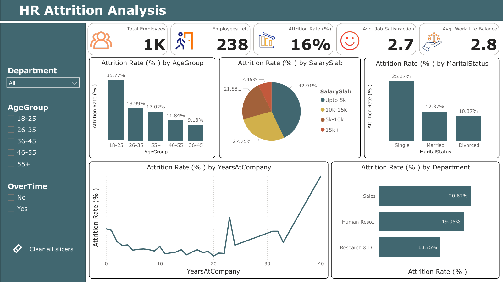

# ✨ HR Attrition Analysis

**Project Type:** Power BI Dashboard  
**Purpose:** Learn and practice Power BI data modeling, dashboard design, and HR analytics.


## 📘 Project Overview

This project analyzes employee attrition using a structured HR dataset.  
The goal is to understand which employee groups are at higher risk of leaving and what organizational factors contribute to attrition.

The interactive Power BI dashboard visualizes:

- Attrition by age, department, salary slab, marital status  
- Trends across years at company  
- Key HR metrics (satisfaction, work-life balance, total employees, employees left)

This project helps HR teams make better decisions using data-driven insights.


## 🧩 Dataset Details

**Dataset Name:** `HR_Analytics_Raw_Dataset.csv`  
**Total Records:** 1480 employees  
**Total Columns:** 38

### 📄 Major Columns
- Employee ID  
- Age, Gender  
- Department  
- Job Role  
- Education & Field of Education  
- Salary Slab  
- Attrition (Yes/No)  
- Years at Company  
- Job Satisfaction Score  
- Work Life Balance Score  
- Marital Status  
- OverTime (Yes/No)


## 🧠 Project Objectives
- Identify the factors influencing employee attrition  
- Compare attrition rates across key demographic categories  
- Analyze tenure-based attrition patterns  
- Provide insights to help HR improve retention and employee well-being  
- Build a clean, professional Power BI dashboard  


## 📂 File Details

### 📊 Dashboard Files
- `dashboard/HR Attrition Analysis_Dashboard.pbix` — Main Power BI dashboard  
- `dashboard/Dashboard-Page-1.png` — Screenshot of dashboard page  

### 📁 Data Files
- `data/HR_Analytics_Raw_Dataset.csv` — Original dataset used for cleaning and analysis  

### 📁 KPI Icons
- Icons used for KPIs in dashboard

### 📄 Report Files
- `report/HR Attrition Analysis Report.docx` — Written analysis, insights, and recommendations  
- `report/HR Attrition Analysis_Task Brief.docx` — Original project task description  


## ⚙️ Tools Used

| Tool | Purpose |
|------|----------|
| **Power Query Editor** | Data cleaning |
| **Power BI** | Data analysis and dashboard creation |


## 📊 Dashboard Preview

### 🖼 Dashboard — Attrition Overview



## 🔍 Analysis Process

1. **Data Cleaning**  
2. **Data Preparation**  
3. **Dashboard Design**


## 🔎 Key Insights (from Dashboard & Report)

- Younger employees and employees with lower salaries are more likely to leave, indicating income expectations and career exploration.  
- The **Sales** department shows higher attrition, possibly due to work pressure or job dissatisfaction.  
- **Single employees** may prefer more flexibility or new opportunities, leading to higher turnover.  
- Employees tend to leave early in their tenure if expectations are unmet — highlighting onboarding or role-clarity issues.  
- Average job satisfaction (2.7) and work–life balance (2.8) are below ideal levels.  
- Seasonal trends: Delays peak in **March** and improve toward **November**.


## 💡 Recommendations

- Improve onboarding and early-stage engagement  
- Review compensation structure for lower salary slabs  
- Focus on Sales department well-being  
- Enhance work–life balance programs  
- Provide career growth opportunities for young and single employees  


## 🎯 Learning Outcomes

By completing this project, the following skills were practiced and improved:

- Power BI dashboard development  
- Data modeling and DAX calculations  
- Building KPI visuals & performance metrics  
- HR data analysis and interpretation  
- Designing interactive dashboards with slicers  
- Summarizing business insights in simple, human language  


## 🏗 Project Structure

```
HR_Attrition_Analysis/
│
│-- dashboard/
│     ├── HR Attrition Analysis_Dashboard.pbix
│     ├── Dashboard-Page-1.png
│
│-- data/
│     ├── HR_Analytics_Raw_Dataset.csv
│
│-- KPI_Icons/
│     ├── (Icons used for KPIs in dashboard)
│
│-- report/
│     ├── HR Attrition Analysis Report.docx
│     ├── HR Attrition Analysis_Task Brief.docx
│
└── README.md
```


## 🚀 How to Use This Project

1. Download **HR Attrition Analysis_Dashboard.pbix**  
2. Open the file in **Microsoft Power BI Desktop**  
3. Explore the dashboard using the available filters  
4. View insights from all visuals and KPI indicators  
5. Read the **HR Attrition Analysis Report.docx** for detailed findings  


**Yash Patil** 
